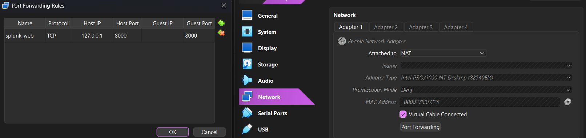
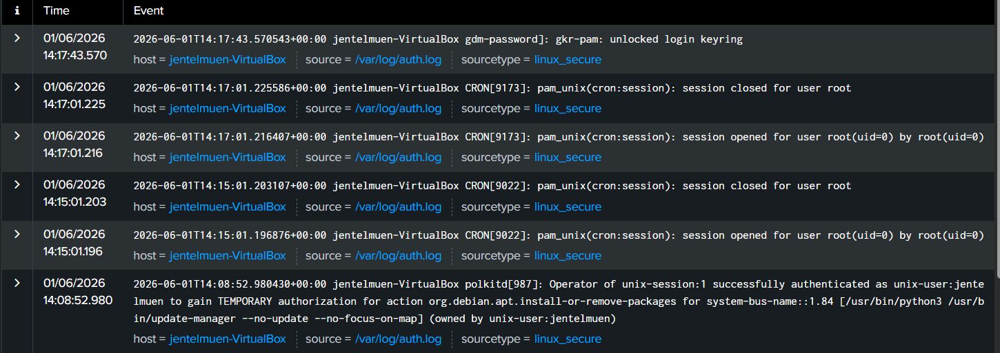

\## 🏢 Архітектура лабораторії


\* \*\*Хост:\*\* Windows 11

\* \*\*Гіпервізор:\*\* Oracle VirtualBox

\* \*\*Гостьова ОС (SIEM):\*\* Ubuntu Server 24.04 LTS (Виділено: 4GB RAM, 2 vCPU)

\* \*\*Програмне забезпечення:\*\* Splunk Enterprise (Free License)


\## 🛠️ Етап 1: Встановлення та налаштування мережі


1\. Завантажено інсталяційний пакет Splunk Enterprise у форматі `.deb`.

2\. Пакет було перенесено на віртуальну машину та встановлено за допомогою команд:


```bash

sudo dpkg -i splunk\_package\_name.deb

sudo /opt/splunk/bin/splunk start --accept-license

```

Для забезпечення доступу до веб-інтерфейсу Splunk з хостової машини (Windows) через браузер, у налаштуваннях VirtualBox було реалізовано Port Forwarding:


Host IP: 127.0.0.1 -> Host Port: 8000


Guest Port: 8000


Після цього веб-інтерфейс успішно став доступний за адресою http://127.0.0.1:8000.





\## 🔍 Етап 2  Перевірка збору логів (Data Verification)

Після налаштування локального джерела даних у Linux було проведено тестовий пошуковий запит index="linux\_security". Результати успішного індексування подій безпеки відображено на скріншоті нижче.





📊 Технічний розбір зафіксованих подій:

Ідентифікація метаданих: Splunk коректно розібрав логи (parsing). Кожна подія має автоматично визначені поля:


host = jentelmuen-VirtualBox (ім'я машини-джерела).

source = /var/log/auth.log (конкретний файл логів).

sourcetype = linux\_secure (правило форматування для систем безпеки Linux).

Аналіз активності в системі (Аналітика інцидентів):

Автентифікація через GUI: Подія від 14:17:43 (gdm-password]: gkr-pam: unlocked login keyring) показує успішне розблокування зв'язки ключів користувача при вході в графічний інтерфейс системи.

Робота планувальника завдань (CRON): Події о 14:15:01 та 14:17:01 фіксують регулярну роботу крона. Ми бачимо цикли відкриття та закриття сесій для користувача root (uid=0):

pam\_unix(cron:session): session opened for user root

pam\_unix(cron:session): session closed for user root

Керування привілеями (Політики безпеки): Найнижчий лог від 14:08:52 показує роботу демона polkitd\[987]. Користувач jentelmuen отримав тимчасову авторизацію (TEMPORARY authorization) для виконання адміністративної дії: оновлення або встановлення пакетів через менеджер оновлень (update-manager).

🔌 Етап 3: Підключення Windows-ендпоінту через Splunk Universal Forwarder

Для симуляції реального SOC-середовища було налаштовано збір логів безпеки з хост-машини (Windows) та їх пересилання на SIEM-сервер (Linux Ubuntu).


1\. Налаштування приймача (Indexer) на стороні Splunk:

У веб-інтерфейсі Splunk перейшов у Settings -> Forwarding and receiving -> Receive data.

Активував прослуховування мережевого порту 9997.

Створив окремий логічний індекс для хостових логів: windows\_security.


2\. Встановлення та конфігурація Universal Forwarder на Windows:

На хостовій системі встановлено офіційний пакет Splunk Universal Forwarder. Конфігурацію збору та відправки логів реалізовано через редагування інституційних .conf файлів у директорії C:\\Program Files\\SplunkUniversalForwarder\\etc\\system\\local\\:


outputs.conf (Вказівка вектору пересилання):

\[tcpout]

defaultGroup = default-autolb-group


\[tcpout:default-autolb-group]

```
server = 127.0.0.1:9997

inputs.conf (Визначення джерел логів):

\[WinEventLog://Security]

disabled = 0

start\_from = oldest

current\_only = 0

index = windows\_security

```


3\. Мережева інтеграція через VirtualBox:

Оскільки віртуальна машина працює в режимі мережі NAT, у налаштуваннях гіпервізора було створено додаткове правило Port Forwarding:


Host Port: 9997 -> Guest Port: 9997 (IP-адреси залишено пустими для динамічної прив'язки).

